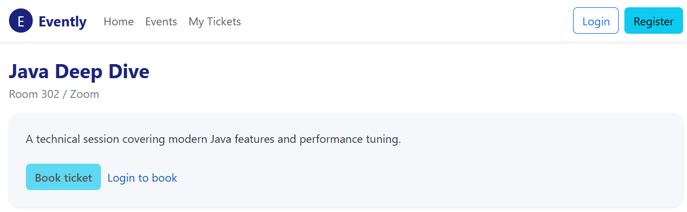
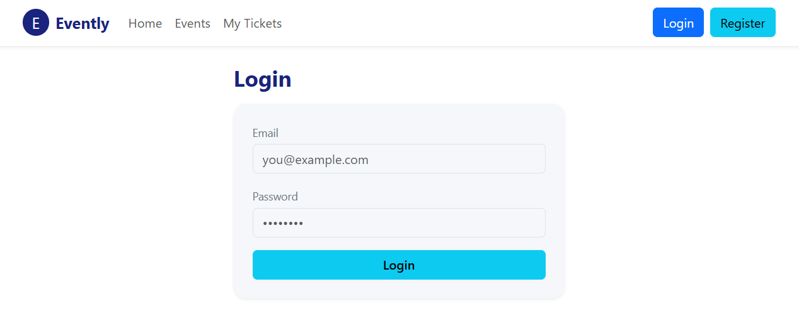
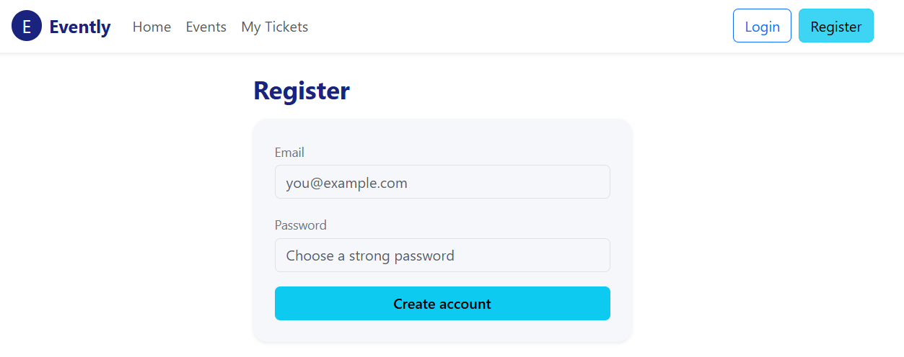
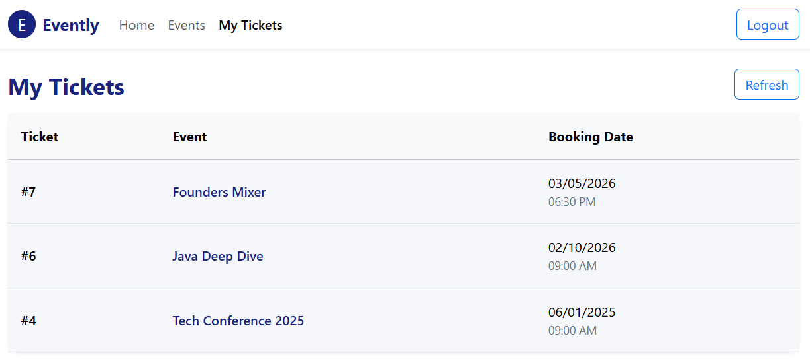
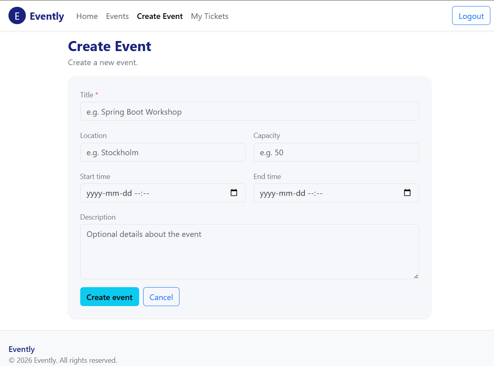

# Event Management System (Evently)

A full-stack event management system where users can browse events, book tickets, and view their own tickets. Admin users can create/update/delete events.

## Screenshots

### Home / Events List


### Event Details


### Login / Register




### My Tickets


### Admin: Create/Edit Event



---

## Features

### Public (no login)
- Browse all events
- View event details

### Authenticated user (JWT required)
- Book a ticket for an event
- View “My Tickets”

### Admin only (JWT + role required)
- Create events
- Update events
- Delete events

---

## Tech Stack

### Backend
- Java + Spring Boot
- Spring Security (JWT authentication)
- Spring Data JPA + Hibernate
- PostgreSQL

### Frontend
- React
- Fetch/Axios wrapper (via a shared `request()` client)
- Token stored in session storage

---

## Project Structure

- `src/` → Spring Boot backend
- `evently-frontend/` → React frontend

## Running the Project

### Backend
1. Create a PostgreSQL database
2. Configure `application.properties`:
```properties
spring.datasource.url=jdbc:postgresql://localhost:5432/evently
spring.datasource.username=YOUR_USER
spring.datasource.password=YOUR_PASSWORD
jwt.secret=YOUR_SECRET
```

## Frontend

### Prerequisites
- Node.js
- npm

### Install dependencies
```bash
npm install
```

### Environment variables

Create `.env` file in the frontend folder:

```env
REACT_APP_API_BASE_URL=http://localhost:8080
```


### Start frontend:
```bash
npm start
```

The application will run at:
```text
http://localhost:3000
```

## Security & Error Handling

- Stateless JWT authentication
- Role-based authorization enforced server-side
- Clean API error responses with meaningful HTTP status codes
- User-friendly error messages displayed in the UI
- Duplicate bookings and overbooking are prevented

## Design Decisions

- Backend is the source of truth for authorization
- DTOs are used instead of exposing entities
- Frontend role checks are UI-only
- Errors are handled centrally on the backend
- Session storage is used for JWT persistence


## Author

Jalal Khalid  
Computer Science student @ KTH  